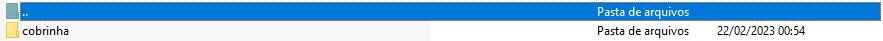
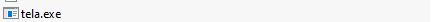
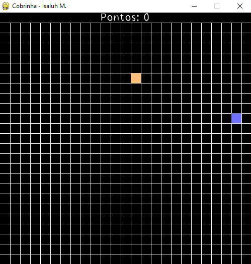

<h1 align="center"> Passo a passo </h1>

## 

> Fassa o download do arquivo WinRar vinculado ao projeto.

## 

> Abra-o na sua máquina, podendo ou não extrair a pasta.

## 

> Abra a pasta cobrinha.

## 

> Procure o executavel "tela.exe".

## 

> E se divirta utilizando.

---

<h4 align="center">By: Isaluh 🤍</h4>
