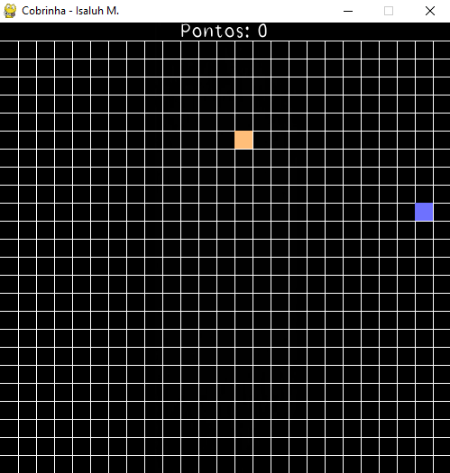

<h1 align="center"> Jogo da Cobrinha </h1>

Projeto feito com python usando a biblioteca pygame.

  <a href="#-tecnologias">Tecnologias</a>&nbsp;&nbsp;&nbsp;|&nbsp;&nbsp;&nbsp;
  <a href="#-projeto">Projeto

 

  

## 🎓 Tecnologias

Esse projeto foi desenvolvido com as seguintes tecnologias:

- Python
- Github

## 📔 Projeto

Projeto de estudos.

---

<h4 align="center">By: Isaluh 🤍</h4>
